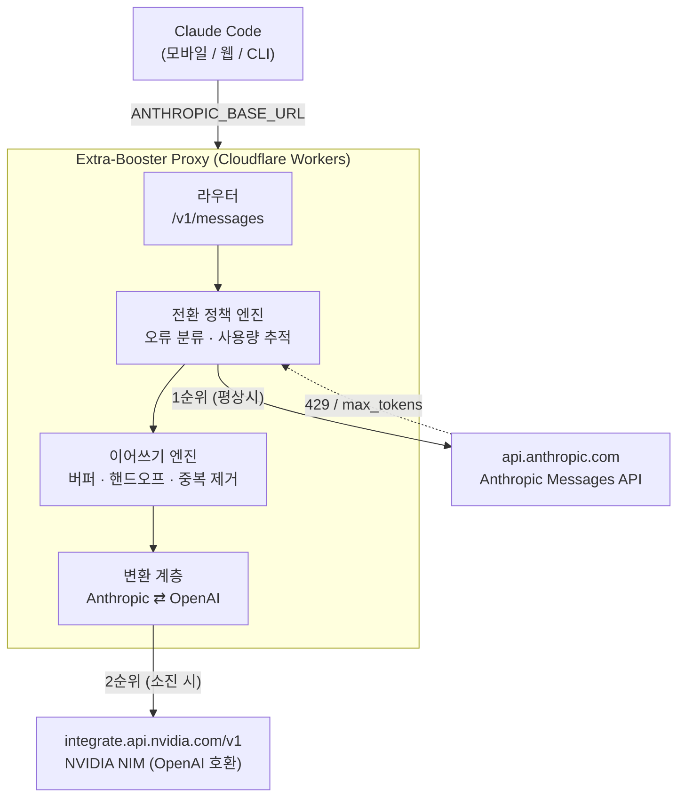

# Extra-Booster 설계·구현 계획

> 클로드코드가 토큰을 모두 사용했을 경우 자동으로 전환하여 끊기지 않게 답변을 마무리하는 NVIDIA 무료 AI

---

## 0. 문제 정의 — "토큰 소진"은 두 가지다

사용자가 체감하는 "답변이 끊긴다"는 현상은 원인이 전혀 다른 두 가지가 섞여 있고, 해결책도 다릅니다. **둘 다 처리해야 "끊기지 않는다"가 성립합니다.**

| | A. 응답 단위 한도 초과 | B. 사용량/레이트 리밋 소진 |
|---|---|---|
| 증상 | 문장 중간에서 뚝 끊김 | 요청 자체가 실패 |
| 신호 | HTTP 200 + `stop_reason: "max_tokens"` | HTTP 429 (`rate_limit_error`) |
| 발생 시점 | 응답 도중 | 요청 시작 시 또는 스트리밍 도중 |
| 해결 | 이어쓰기(continuation) 루프 | 다른 모델로 페일오버 |

Extra-Booster는 **A는 이어쓰기로, B는 NVIDIA 전환으로** 처리하고, 두 경우 모두 클라이언트에게는 **하나의 연속된 응답 스트림**으로 보이게 합니다.

---

## 1. 아키텍처

Claude Code는 `ANTHROPIC_BASE_URL` 환경변수로 업스트림을 바꿀 수 있습니다. 이 지점에 Anthropic Messages API와 **완전히 동일한 형태로 말하는 프록시**를 끼워 넣는 것이 전체 설계의 핵심입니다. 클라이언트(Claude Code)는 자기가 프록시와 대화하는지 모릅니다.



### 왜 프록시인가

- **클라이언트 수정 불필요** — Claude Code 자체를 고칠 수 없으므로, 프로토콜 경계에서 개입하는 것이 유일하게 현실적인 지점입니다.
- **모바일 제약** — 폰에서 로컬 프로세스를 상시 구동할 수 없습니다. 엣지에 배포된 프록시라면 폰은 URL만 가리키면 됩니다.
- **관측 가능성** — 전환 시점·빈도·비용을 한 곳에서 볼 수 있습니다.

---

## 2. 기술 스펙 (확인 완료)

### 2.1 Anthropic Messages API — 스트리밍 SSE 이벤트 순서

프록시가 클라이언트에게 **정확히 이 순서로** 내보내야 합니다.

```
message_start          → 메시지 메타데이터
content_block_start    → 블록 시작 (index=0)
content_block_delta ×N → text_delta 조각들
content_block_stop     → 블록 종료
message_delta          → stop_reason, usage
message_stop           → 종료
```

이어쓰기의 핵심 트릭: **`content_block_stop`을 보내지 않고 `content_block_delta`를 계속 이어 붙이면**, 클라이언트는 하나의 블록이 계속 오고 있다고 인식합니다. 여기서 "끊기지 않음"이 성립합니다.

### 2.2 NVIDIA NIM 무료 엔드포인트

| 항목 | 값 |
|---|---|
| Base URL | `https://integrate.api.nvidia.com/v1` |
| 프로토콜 | OpenAI Chat Completions 호환 |
| 인증 | `Authorization: Bearer nvapi-...` |
| 레이트 리밋 | 커뮤니티 기준 **약 40 RPM**, 초과 시 429 + `Retry-After` |
| 용도 제한 | 개발·테스트·평가·연구용. 프로덕션은 NVIDIA AI Enterprise 필요 |

**중요:** NVIDIA 무료 티어도 40 RPM에서 429를 냅니다. 즉 "무한 백업"이 아니라 **"2차 예비"**입니다. NVIDIA까지 막혔을 때의 정직한 종료 경로(§6.3)를 반드시 설계해야 합니다.

### 2.3 변환 매핑 (Anthropic ⇄ OpenAI)

| Anthropic | OpenAI (NIM) | 비고 |
|---|---|---|
| `system` (문자열/블록 배열) | `messages[0] = {role:"system"}` | 블록 배열은 `\n\n`로 병합 |
| `messages[].content` 블록 배열 | 문자열 또는 `content` 파트 배열 | 텍스트만 있으면 문자열로 평탄화 |
| `tools[].input_schema` | `tools[].function.parameters` | 스키마 그대로 이식 |
| `tool_use` 블록 | `assistant.tool_calls[]` | `input`(객체) ↔ `arguments`(JSON 문자열) |
| `tool_result` 블록 | `{role:"tool", tool_call_id}` | user 턴 → 별도 메시지들로 분해 |
| `max_tokens` | `max_tokens` | 그대로 |
| `stop_reason: "end_turn"` | `finish_reason: "stop"` | |
| `stop_reason: "max_tokens"` | `finish_reason: "length"` | 이어쓰기 트리거 |
| `stop_reason: "tool_use"` | `finish_reason: "tool_calls"` | |
| `usage.input/output_tokens` | `usage.prompt/completion_tokens` | |

**주의:** Claude 4.6+ / Opus 5 / Sonnet 5 계열은 **assistant prefill(마지막 턴을 assistant로 끝내기)이 400 오류**입니다. 따라서 Anthropic 쪽으로 이어쓰기를 보낼 때는 prefill을 쓸 수 없고, user 턴에 "직전 응답이 여기서 끊겼다: …. 이어서 작성하라"는 지시를 담아야 합니다. NVIDIA(OpenAI 호환) 쪽은 trailing assistant 메시지를 대체로 허용하지만, 모델마다 다르므로 **user 턴 방식을 기본으로, prefill은 모델별 옵션으로** 둡니다.

---

## 3. 무중단 이어쓰기 알고리즘

이 프로젝트의 실제 난이도는 전부 여기에 있습니다.

### 3.1 기본 흐름

```
1. 업스트림 스트림을 중계하면서 방출한 모든 텍스트를 buffer에 누적
2. 중단 감지:
     - stop_reason == "max_tokens"      → 이어쓰기
     - 429 / 5xx / 타임아웃 / 연결 끊김  → 페일오버 후 이어쓰기
3. content_block_stop 을 보내지 않고 보류
4. 다음 모델에 요청 구성:
     원본 system + 원본 messages
     + "직전 응답이 다음 텍스트에서 중단되었다. 겹치지 말고, 서두 없이 이어서 완성하라: <buffer 끝 N자>"
5. 새 응답의 델타를 같은 content block index 로 계속 방출
6. 다시 max_tokens 면 2로 (상한까지)
7. 정상 종료 시 content_block_stop → message_delta → message_stop
```

### 3.2 반드시 처리해야 할 함정

| 함정 | 왜 문제인가 | 처리 |
|---|---|---|
| **중복 텍스트** | 이어받은 모델이 마지막 문단을 다시 씀 | buffer 말미 200자와 신규 텍스트 앞부분의 최장 공통 접두를 찾아 제거 |
| **UTF-8 멀티바이트 분할** | 한글은 3바이트. 청크 경계에서 잘리면 `` 출력 | `TextDecoder({stream:true})`로 디코딩, 중복 제거는 **바이트가 아닌 코드포인트/자소 단위**로 |
| **도구 호출 중간 절단** | 부분 JSON은 이어붙일 수 없음 | 해당 `tool_use` 블록은 폐기하고 처음부터 재생성. 이미 `content_block_start`를 보냈다면 빈 입력으로 stop 후 새 인덱스로 시작 |
| **무한 이어쓰기** | 모델이 계속 max_tokens에 걸림 | 이어쓰기 횟수 상한(기본 5) + 누적 문자 상한. 초과 시 정직하게 절단 고지 |
| **usage 집계** | 여러 모델 토큰이 섞임 | `message_delta.usage`는 전체 합산값으로 보고, 내부 로그에 모델별 분리 기록 |
| **thinking 블록** | 모델 간 replay 불가 | 이어쓰기 시 thinking 블록은 전달하지 않음 |

### 3.3 핸드오프 프롬프트 (초안)

```
[이전 응답이 도중에 중단되었습니다]
아래는 이미 사용자에게 전달된 텍스트의 마지막 부분입니다:
---
{buffer_tail}
---
위 텍스트의 바로 다음 글자부터 이어서 작성하세요.
- 이미 쓴 내용을 다시 쓰지 마세요.
- "계속하겠습니다" 같은 서두를 붙이지 마세요.
- 문장 중간에서 끊겼다면 그 문장부터 이어서 완성하세요.
```

---

## 4. 전환 정책

### 4.1 오류 분류 — 429가 다 같은 429가 아니다

```
429 수신
├─ Retry-After ≤ 5초 & 첫 시도      → 대기 후 Anthropic 재시도 (일시적 혼잡)
├─ Retry-After > 60초 또는 재시도 2회 실패 → NVIDIA 전환 (한도 소진)
└─ 본문에 사용량 한도 문구 포함       → 즉시 NVIDIA 전환
5xx / 529 (overloaded)              → 지수 백오프 2회 → NVIDIA 전환
연결 끊김 / 타임아웃                 → 즉시 NVIDIA 전환 + 이어쓰기
```

### 4.2 선제적 전환

응답 헤더의 `anthropic-ratelimit-*` 계열을 파싱해 잔여량이 임계치(예: 5%) 아래로 떨어지면, **다음 요청부터 미리** NVIDIA로 보냅니다. 응답 도중에 벽을 치는 것보다 처음부터 NVIDIA로 가는 편이 사용자 경험이 낫기 때문입니다.

### 4.3 최종 방어선

NVIDIA도 429일 때는 조작할 여지가 없습니다. 무한 재시도로 매달리지 말고, 지금까지 생성된 텍스트 뒤에 명시적 고지를 붙이고 정상 종료합니다.

```
⚠️ Anthropic·NVIDIA 양쪽 한도에 도달하여 여기서 중단합니다. (약 N분 후 재시도 가능)
```

---

## 5. 정직성 — 모델 전환은 표시한다

NVIDIA 무료 모델은 Claude와 품질이 같지 않습니다. 특히 **도구 호출 정확도와 긴 코드 생성**에서 차이가 큽니다. 사용자가 모르는 채로 품질이 떨어지는 것이 끊기는 것보다 나쁩니다.

전환 지점에 마커를 삽입합니다 (기본 켜짐, 설정으로 끌 수 있음):

```
⚡ Extra-Booster: 토큰 한도 도달 — NVIDIA(qwen2.5-coder-32b)로 이어서 응답합니다.
```

---

## 6. 모듈 구조

```
src/
├── index.ts              # 엔트리. 라우팅, 인증, CORS
├── policy.ts             # 오류 분류, 전환 판정, 사용량 임계치 추적
├── upstream/
│   ├── anthropic.ts      # 1순위 클라이언트. 헤더 패스스루, SSE 파싱
│   └── nvidia.ts         # 2순위 클라이언트. NIM(OpenAI 호환)
├── translate/
│   ├── request.ts        # Anthropic Messages → OpenAI Chat (§2.3)
│   ├── response.ts       # OpenAI 비스트리밍 응답 → Anthropic Message
│   └── stream.ts         # OpenAI SSE → Anthropic SSE 이벤트 시퀀스
├── continuation.ts       # 버퍼, 핸드오프 프롬프트, 중복 제거, 루프 상한
├── sse.ts                # SSE 파서/시리얼라이저 (UTF-8 스트리밍 안전)
├── state.ts              # 사용량 윈도우 (Workers KV)
└── config.ts             # 모델 매핑, 상한값, 마커 on/off

test/
├── fixtures/             # 실제 SSE 스트림 녹화본
├── stream.test.ts        # 변환 골든 테스트
├── continuation.test.ts  # 장애 주입 (오프셋별 절단)
└── policy.test.ts        # 오류 분류 표
```

**런타임 선택: TypeScript + Cloudflare Workers (무료 티어)** — 상시 대기 비용 0, 콜드스타트 낮음, 스트리밍 패스스루는 I/O 바운드라 CPU 제한(10ms/req)에 여유. 대안: Deno Deploy, Vercel Edge, fly.io 소형 VM.

---

## 7. 단계별 로드맵

각 단계는 **그 단계만으로도 동작하는 상태**로 끝나야 합니다. 마지막에 한 번에 합치는 방식은 이 종류의 프로젝트에서 반드시 실패합니다.

| Phase | 내용 | 완료 기준 |
|---|---|---|
| **0. 준비** | NVIDIA API 키 발급, 모델 후보 3종 선정·수동 테스트, 호스팅 결정 | `curl`로 NIM 스트리밍 응답 확인 |
| **1. 패스스루** | Anthropic만 중계하는 무투명 프록시. SSE 무결성, 헬스체크 | Claude Code가 프록시 경유로 평소와 100% 동일하게 동작 |
| **2. 변환 계층** | 요청/응답/스트림 3방향 변환. NVIDIA 단독 모드 | `FORCE_NVIDIA=1`로 Claude Code가 NVIDIA만으로 대화 성립 |
| **3. 전환 정책** | 오류 분류, 백오프, 선제 임계치 | 429 모의 주입 시 NVIDIA로 자동 전환 |
| **4. 이어쓰기** ★ | mid-stream 핸드오프, 중복 제거, max_tokens 체이닝 | 임의 오프셋 절단 시 이음매 없는 연속 텍스트 |
| **5. 도구·UX** | 도구 호출 절단 처리, 전환 마커, 구조적 로깅 | 도구 사용 세션에서 전환해도 루프 유지 |
| **6. 배포** | 시크릿 설정, 프록시 자체 인증, 모바일 설정 문서 | 폰에서 URL만 바꿔 사용 가능 |

Phase 4가 전체 난이도의 절반입니다. Phase 1~3은 각각 하루 단위, Phase 4는 여유 있게 잡아야 합니다.

---

## 8. 테스트 전략

**녹화-재생(golden fixture) 방식이 핵심입니다.** 라이브 API로 장애를 재현할 수 없기 때문입니다.

1. **녹화** — 실제 Anthropic/NVIDIA SSE 스트림을 바이트 단위로 저장
2. **장애 주입** — 저장된 스트림을 임의 오프셋에서 잘라 재생
   - 단어 중간 / 문장 중간 / **한글 3바이트 문자 중간** / 도구 JSON 중간 / `message_delta` 직전
3. **불변식 검증** — 모든 케이스에서:
   - 출력 SSE가 유효한 Anthropic 이벤트 시퀀스인가
   - `content_block_start` 하나당 `content_block_stop` 하나인가
   - 이어붙인 텍스트에 중복 구간이 없는가
   - 항상 `message_stop`으로 끝나는가
4. **E2E** — 실제 Claude Code를 프록시에 붙여 긴 코드 생성 작업 수행

---

## 9. 보안

- `nvapi-` 키는 **절대 코드에 하드코딩하지 않음.** Workers Secret으로 주입. 폰에서 다루지 않고 웹 대시보드/CI에서만 설정.
- 프록시는 **자체 인증 토큰을 요구**합니다. 그렇지 않으면 누구나 쓸 수 있는 공개 릴레이가 됩니다.
- 기본 로깅에 **메시지 본문을 남기지 않음.** 이벤트 타입·토큰 수·전환 사유만 기록.
- Anthropic 인증 헤더(`x-api-key` 또는 OAuth `Authorization`)는 **읽지 않고 그대로 전달**합니다.

---

## 10. 리스크

| 리스크 | 영향 | 대응 |
|---|---|---|
| **Claude Pro 구독(OAuth) 인증이 커스텀 base URL을 거부할 수 있음** — 사용 환경이 Pro 구독으로 확정되어 이 리스크는 가정이 아니라 실제 조건입니다 | **치명적** — 전제가 무너짐 | **Phase 1에서 최우선 검증. 다른 어떤 작업보다 먼저.** 실패 시 API 키 인증(종량제) 전환 또는 설계 재검토. 검증 절차는 [GUIDE.md 5-1단계](./GUIDE.md) |
| NVIDIA 무료 티어 40 RPM | 2차 소진 | 선제 백오프 + §4.3 정직한 종료 |
| NVIDIA 프로덕션 사용 금지 조항 | 법적 | 개인 개발·평가 용도로 한정. 문서에 명시 |
| 모델 간 도구 호출 형식 차이 | 도구 루프 파손 | Phase 5에서 모델별 화이트리스트, 미지원 모델은 도구 없이 텍스트만 |
| 품질 저하 | 사용자 불만 | 전환 마커(§5)로 항상 고지 |

---

## 11. 결정이 필요한 사항

1. **NVIDIA 모델 선택** — 코딩 위주면 `qwen2.5-coder-32b-instruct`, 범용이면 `llama-3.3-70b-instruct`, 추론 중시면 `deepseek-r1`. Phase 0에서 실제 프롬프트로 비교 후 결정.
2. **호스팅** — Cloudflare Workers 권장. 이미 쓰는 인프라가 있으면 그쪽 우선.
3. **전환 마커 기본값** — 켜짐 권장(§5). 완전히 매끄러운 경험을 원하면 끌 수 있게.
4. **참고 구현** — `claude-code-router` 등 기존 OSS가 Phase 1~3에 해당하는 부분을 이미 구현해 두었습니다. 처음부터 만들지, 포크해서 Phase 4(이어쓰기)만 얹을지 결정 필요. **후자가 훨씬 빠릅니다.**

---

## 참고

- [NVIDIA NIM API Pricing 2026: Free Tier, 40 RPM & Real Cost](https://decodethefuture.org/en/nvidia-nim-api-pricing-limits-guide/)
- [NVIDIA Build Free API: 100+ AI Models on DGX Cloud (2026 Guide)](https://pasqualepillitteri.it/en/news/1621/nvidia-build-free-api-100-ai-models-2026)
- [Try NVIDIA NIM APIs (build.nvidia.com)](https://build.nvidia.com/)
- [NVIDIA NIM API Explained: Models, Architecture and Use Cases](https://decodethefuture.org/en/nvidia-nim-api-explained/)
